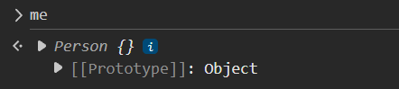
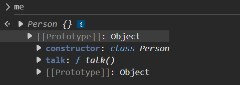
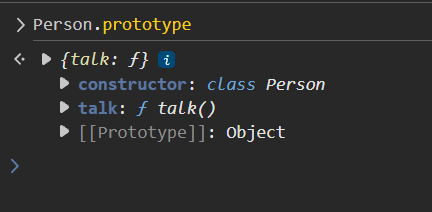
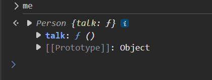

Inheritance is a concept in programming that allows one object to access the properties and methods of another object.

This is mainly used for reducing code duplication and improving code organization.

Now, unlike other programming languages, Javascript has a pretty unique way of implementing inheritance. There are two main ways to implement inheritance in Javascript - 

    1. Prototype-based Inheritance (The Old Way)
    2. Class-based Inheritance (The Modern Way)

To understand why do we need inheritance, let's say we have two objects - "Me" and "You". Both the objects have a function named "talk" and in both cases, we console log the same thing.

    const me = {
        talk () {
            console.log('Talking!');
        }
    }

    const you = {
        talk () {
            console.log('Talking!');
        }
    }

So here, we have two objects with the same function. We had to write the same code twice and this is obviously code duplication. You might argue that we have only one line of code in this function so it is okay if we are duplicating it. But, think of a real-world scenario where you have a function with 100 lines of code. In that case, it would be a pain to duplicate the code in multiple objects. So, we need a way to avoid this duplication.

Moreover, here, we just have two objects. But, in a real-world scenario, we might have a lot of objects and if we have to duplicate the code in all of them, it would be a nightmare

What if later on, we want to change the code in the function? We will have to go to all the objects and change it. This is a lot of work and it is not efficient at all.

And that's where "Inheritance" comes in.

# INTRODUCING INHERITANCE

To solve this issue with code duplication, we can create a class using the 'class' keyword. Let's say we create a class named "Person" which has a function named "talk".

    class Person {
        talk () {
            console.log('Talking!');
        }
    }

Now, we can create a new object named "me" which is an instance of the "Person" class. We can do this using the 'new' keyword.

    const me = new Person();

Similarly we can create another object named "you" which is also an instance of the "Person" class.

    const you = new Person();

And now, we can call the "talk" function on both the objects.

    me.talk(); // Talking!
    you.talk(); // Talking!

So, we can have 100s of objects and still, the function will be at one place. And if we want to change the code in the function in the future, we can just go to the class and change it.

So, when we created "me" or "you" using the "new" keyword, what exactly are these? How do they look like under the hood?

Maybe, let's try to console log them in the browser console and see what we get.

If we console.log(me), we will get this -

So, "me" is of type "Person" but there is no "talk" function here for the "me".

All we see is something called [[Prototype]] and if we expand it, we can see the "talk" function there -

It basically means that "me" does not have any properties or methods of its own as of now but it has access to the "talk()" function as it inherits that from "Person".

This link between "me" and "Person" is maintained by an internal property of objects referred to as [[Prototype]]. And that's what we see in the above screenshot. So, to the object "me", its "prototype" is whatever is present in the [[Prototype]] property.

The value of this [[Prototype]] property can be any object as long as you do not create a circular reference. If object "A" has a [[Prototype]] property that points to another object "B", which in turn has a [[Prototype]] property, then the object "A" will inherit from both the object "B" and also the [[Prototype]] property of the object "B". This is called "prototype chain" and this chain will keep going until some object in this chain has a property that is null.

If we want to get it or set it then we have to use the "Object.getPrototypeOf()" and "Object.setPrototypeOf()" methods. You can also get/set it by - 

    me.__proto__

But, it is not recommended as it is a legacy property and in modern javascript, we should use the "Object.getPrototypeOf()"  and "Object.setPrototypeOf()" methods.

If you console log "Person.prototype", you will see an object like this -

This looks kind of similar to what we got in the [[Prototype]] property of the "me" object, right?

In fact, this is exactly the same object. If you compare both, the result will be "true" -

    Person.prototype === Object.getPrototypeOf(me) // true
    Person.prototype === me.__proto__ // true

Do we have a "prototype" property on the "me" object? No. But we have this on "Person". Why so?

Well, the "class" keyword was introduced in 'ES6' and it is like a syntactical sugar (not just a syntactic sugar, though) over the existing prototype-based inheritance. So, when we create a class using the "class" keyword, it creates a constructor function under the hood and this constructor function has a "prototype" property.

This is what happens -

    function Person() {}

    Person.prototype.talk = function () {
        console.log('Talking!');
    }

So, under the hood, "Person" is a constructor function and the "talk" function is added to the 'prototype' of this constructor function.

Let's say we want to update the "talk" function in the "Person" class. We can do this by just updating the "talk" function in the "Person.prototype" object.

    Person.prototype.talk = function () {
        console.log('Talking! Updated!');
    }

Now, of course we could've also written -

    function Person() {
        this.talk = function () {
            console.log('Talking!');
        }
    }

And then, if we do -

    const me = new Person();
    me.talk();

It still works the same.

But, if we print "me", then you will see something different this time - 

Here, we see that the function "talk" is present in the "me" object itself. So, why do we need "prototype" at all if we can simple add the functions using the "this" keyword in the constructor function?

So, if we print - 

    Person.prototype.talk

This is actually "undefined". That's because now, "talk" is a property that will be there in every instance of the "Person" class. So, if we create another instance of the "Person" class, it will also have its own "talk" function. So, even if we write -

    Person.prototype.talk = function () {
        console.log('Talking! Updated!');
    }

The "me.talk()" will still print "Talking!" because "me" still has its own "talk" function.

So, when we use "this" keyword to create a function inside a constructor function, then this function will be copied over for every instance. So, if we create 100 instances of the "Person", then there will be 100 copies of the "talk" function in each instance. This is a lot of memory and it is not efficient at all.

And this also means that if we update the "talk" function in one instance, it will not be updated in the other instances. So, we will have to go to all the instances and update it. This is a lot of work and it is not efficient at all. This clearly defeats the purpose of inheritance.

So, it is pretty common to add all the properties using the "this" keyword inside the constructor function and add all the methods to the "prototype" of the constructor function. This way, all the instances will have access to the same method and if we update it in one place, it will be updated for all the instances.

Remember that "prototype" is only available on the constructor functions and not on the instances. That's why there is no "prototype" property on the "me" object. On the other hand, "proto" is available everywhere, on the instances and also on the constructor functions.

So, the bottom line is -

    When you create a constructor function, a property called 'prototype' is automatically created for you (you didn't create it yourself). It is the prototype of objects constructed by that function. e.g. 'Person' in our case has a 'prototype' property because this is a constructor function. And since "classes" in JavaScript are just syntactical sugar over constructor functions, they also have a prototype property.

    If you create a new instance of 'Person', you are basically creating (among other things) a new object that has an internal or private link to the  Person's prototype. The private linkage is called double brackets prototype or just [[Prototype]].

    '__proto__' is a property of all objects that points to the prototype of the constructor function that created the object. '__proto__' is not recommended to be used in Modern javascript. Instead, use 'Object.getPrototypeOf()' and 'Object.setPrototypeOf()' methods.

# EXTENDING CLASSES

Let's say we have a class 'Human' and all the instance of this class can "talk" so there is a "talk" method in it -

    class Human {
        talk () {
            console.log('Talking!');
        }
    }

And maybe we have a class 'SuperHuman' and all the instance of this class can "fly" so there is a "fly" method in it -

    class SuperHuman {
        fly () {
            console.log('Flying!');
        }
    }

But, all the instances of the "SuperHuman" class can also "talk". So, one way is to duplicate the "talk" method in the "SuperHuman" class as well -

    class SuperHuman {
        fly () {
            console.log('Flying!');
        }

        talk () {
            console.log('Talking!');
        }
    }

But yet again, this is code duplication and we do not want that.

What if we could inherit the "talk" method from the "Human" class in the "SuperHuman" class? Well, we can do that using the "extends" keyword.

We can do this by writing -

    class SuperHuman extends Human {
        fly () {
            console.log('Flying!');
        }
    }

So, what's happening here?

In JavaScript, extending classes means creating a new class based on an existing one, inheriting its properties and methods.

Here, "SuperHuman" is a subclass of "Human". This means that "SuperHuman" will inherit all the properties and methods of the "Human" class. So, if we create an instance of the "SuperHuman" class, it will have access to the "talk" method as well.

    const superman = new SuperHuman();
    superman.talk(); // Talking!
    superman.fly(); // Flying!