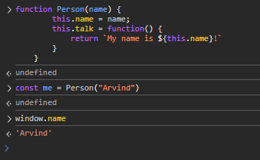
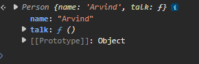
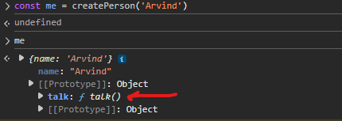

We have already discussed the factory function pattern for creating objects.

As we saw in the "Inheritance" section, there is also a way to create objects using the "new" keyword and then calling some function.

That function is called a 'constructor' function.

It is named so because it is used to 'construct' an object. In Object Oriented Languages, in each class, there is a constructor function that is called when an object of that class is created. This constructor function is used to initialize the object.

The basic idea is similar to the factory function pattern. Whenever we want to create multiple objects of the same type, we can use a constructor function.

Let's take the same example that we used in the factory function pattern. Let's say we have three objects - "me", "ben" and "john".

    const me = {
        name: 'Arvind',
        talk() {
            return `My name is ${this.name}!`
        }
    }

    const ben = {
        name: 'Ben',
        talk() {
            return `My name is ${this.name}!`
        }
    }

    const john = {
        name: 'John',
        talk() {
            return `My name is ${this.name}!`
        }
    }

The difference between constructor function and factory function is that in constructor function, we do not return the object. We use the "new" keyword before calling the function.

So, let's create a constructor function for the above example.

    function Person(name) {
        this.name = name;
        this.talk = function() {
            return `My name is ${this.name}!`
        }
    }

Note that by convention, the constructor function name starts with a capital letter. This is not a rule but a convention. It is a good practice to follow this convention so that it is easy to identify the constructor functions.

Now, we can now create the same three objects like this -

    const me = new Person('Arvind');
    const ben = new Person('Ben');
    const john = new Person('John');

If you notice, we are also using the "this" keyword here. The "this" keyword refers to the object that is being created. So, when we call the constructor function with the "new" keyword, it creates a new object and assigns it to "this".

What if we did not use "new" keyword and simply did -

    const me = Person('Arvind');

What would "me" be in that case? Of course  it will be "undefined" because "Person()" does not return anything. But, still, inside the "Person()" function we are setting some properties on "this". So, what is this "this" then if it is not 'me' here?

Well, in this case "this" will refer to the global object. So, if we are in the browser, "this" will refer to the "window" object. If we are in Node.js, "this" will refer to the "global" object.

And you can see this if you try to console log "window.name" as that will be set to "Arvind".

If we use "new", then if we console log "me", we will see it is an instance of "Person" and has a "name" property and a "talk" method. It also has a "[[Prototype]]" property which is set to "Object".

What this "new" does behind the scenes is that it sets the 'proto' property of the object to the 'prototype' of the constructor function. Remember that every function object automatically has a "prototype" property. Then, it makes sure the "this" keyword points to this newly created object. Then, it returns the newly created object.

So, this constructor function is like a blueprint for creating objects. We can create as many objects as we want using this constructor function.

Can we do the same with the factory functions? Let's say this is our factory function -

    function createPerson(name) {
        return {
            talk() {
                return `My name is ${name}!`
            }
        }
    }

Let's say we want to ensure that the "proto" property of each object that we create using the factory function is set such that it has the "talk" function in it. In other words, the "talk()" function should bot be repeated in each object. It should be in the prototype of the objects created using the factory function.

Yes, We can do that by using "Object.create()". 

This is the syntax of "Object.create()".

    Object.create(proto, propertiesObject)

So, it takes two arguments. The first argument is the 'prototype' object that we want to use. The second argument is an object that contains the properties that we want to add to the new object.

So, we can update our factory function like this -

    const personProto = {
        talk() {
            return `My name is ${this.name}!`
        }
    }

    function createPerson(name) {
        return Object.create(personProto, {
            name: {
                value: name
            }
        });
    }

And now, if we create the objects like this -

    const me = createPerson('Arvind');
    const ben = createPerson('Ben');
    const john = createPerson('John');

We will see that the "talk" function is not repeated in each object. It is in the prototype of the objects created using the factory function.

And so, we can actually do what the constructor function does for us. But, as we saw, the constructor function is much more readable and easier to use.

So, why would we ever need to use the factory function pattern?

Well, the factory function pattern is more flexible and since it is just a plain function, we do not have to care about the "new" or "this" keyword. So, it is easier to use in some cases. 

Moreover, as we saw in the "Factory Function" section, when we want truly private properties, we can use the factory function pattern.

A factory function can return any object, not necessarily a new instance of a specific type.

Constructors always return the object referenced by 'this', unless you override it (which is not idiomatic).

Factory functions don’t rely on prototypes unless you explicitly use them, so they avoid some of the complexity of prototype chains.

Constructor functions are tied to prototypes, and inheritance through them can get tricky.

So, why would we use constructor functions?

When you need inheritance and want to leverage the prototype chain for memory efficiency, you should use constructor functions.

When you're working in an OOP-heavy codebase that uses class/extends syntax (which are basically syntactic sugar over constructor functions), you will use constructor functions.

Remember -

    A factory function is any function which is not a class or constructor that returns a (presumably new) object.
    
    In JavaScript, any function can return an object. When it does so without the 'new' keyword, it’s a factory function.