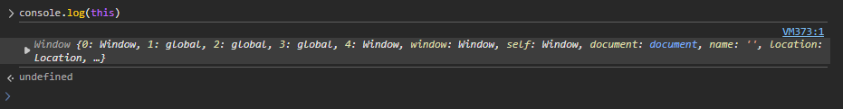
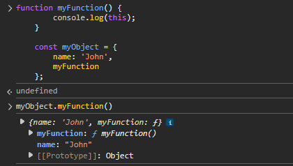
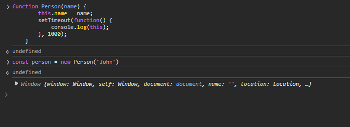

The 'this' keyword in JavaScript can be somewhat confusing, as its value depends on the context in which it is used.

Let's take some examples to illustrate how 'this' works in different scenarios.

What if we simply console log 'this' in our javascript code?

    console.log(this);

What should be the output of this code?

Well, in the browser, 'this' refers to the 'Window' object. This is simply the global object in the browser environment. It represents the entire browser window and provides access to various properties and methods.

All the DOM APIs like 'document' or hte browser APIs like 'location', 'localStorage', etc. are properties of the 'Window' object.

And it is not only in this situation where 'this' refers to the 'Window' object. If we have -

    if (true) {
        console.log(this);
    }

Here too, 'this' will refer to the 'Window' object. This is because the code is being executed in the global context, and 'this' always refers to the global object in such cases.

What if we are inside a function?

    function myFunction() {
        console.log(this);
    }

When we call 'myFunction()', what will 'this' refer to? Well, as it turns out, 'this' will still refer to the 'Window' object in the browser environment.

There is a reason for this. When we define a new function named "myFunction()", this is actually created and attached to the 'Window' object. So, when we write -

    myFunction();

We are actually writing -

    window.myFunction();

And since it is the 'Window' object that is calling the function, 'this' inside the function refers to the 'Window' object.

So, what happens if this "myFunction()" is called differently?

Let's say we have an object like this -

    function myFunction() {
        console.log(this);
    }

    const myObject = {
        name: 'John',
        myFunction
    };

Now, if we say -

    myObject.myFunction();

What will be console logged now?

Well now, 'this' will be the 'myObject' object. This is because when we call a method on an object, 'this' inside that method refers to the object itself (In most cases). So, in this case, 'this' refers to 'myObject'.

There is this general rule here (which is true in most cases) - Whatever is on the left side of the dot when calling a method, 'this' inside that method will refer to that object.

Yes, there are situations where this rule does not apply, but we will cover those later.

And this is the reason why when we called the 'myFunction()' method on the 'myObject', 'this' referred to 'myObject'. When we were calling it on the 'Window' object, 'this' referred to the 'Window' object.

Do note that if you are using the "strict mode" in JavaScript, 'this' will be 'undefined' in the global context and inside functions. This is because strict mode does not allow 'this' to refer to the global object.

Let's say we have a function 'talk' -

    function talk() {
        return `Hello, my name is ${this.name}.`;
    }

Now, we have two object that have a 'name' property and they also use this function -

    const person1 = {
        name: 'John',
        talk
    };

    const person2 = {
        name: 'Jane',
        talk
    };

Now, if we call 'person1.talk()', what will be the output?

It will be -

    Hello, my name is John.

But, if we call 'person2.talk()', what will be the output?

It will be -

    Hello, my name is Jane.

This means, the 'this' keyword, inside the same function, can have different meaning and this all depends on the context in which the function is called.

# BIND

JavaScript is a function-first language, and functions often get passed around—like into setTimeout(), event handlers, or callbacks. When that happens, the original context (i.e., the value of 'this') can be lost.

So far, we saw that if we want to use a function with an object that we created, we have to explicitly add that function to the object. But what if we want to use a function with an object without adding it to the object?

For example, maybe the object on which we want to use the function is created by someone else and we cannot modify it. For example, it might be coming from some external library.

One way to do this is by using the 'bind()' method.

The 'bind()' method in JavaScript is used to create a new function with a permanently bound 'this' value. It doesn’t call the function immediately — it returns a copy of the function with the 'this' keyword fixed to the provided object.

Let's take the same example as above.

    function talk() {
        return `Hello, my name is ${this.name}.`;
    }

Suppose we have an object like this -

    const person = {
        name: 'John'
    };

It does not have a 'talk()' method, but we want to use the 'talk()' function with this object.

Right now, if we do -

    person.talk();

It will throw an error saying 'person.talk is not a function'. 

We can instead use the "bind()" method here to create a new function which has 'this' bound to the 'person' object.

And we do it like this -

    talk.bind(person);

Remember that this does not call the function immediately. It simply returns a new function with 'this' bound to the 'person' object. So, we can save this new function in a variable and call it later.

    const personTalk = talk.bind(person);

Now, if we call 'personTalk()', it will return -

    Hello, my name is John.

Isn't this cool? Even though the 'talk()' function was not a method of the 'person' object, we were able to use it with the 'person' object by binding 'this' to it.

Let's say we had -

    const person = {
        name: 'John',
        talk() {
            console.log(`Hello, my name is ${this.name}.`);
        }
    };

What if, we wrote -

    const personTalk = person.talk;
    personTalk();

This should work, right? Well, no! It won't work as expected because when we call 'personTalk()', 'this' inside the 'talk()' method will not refer to the 'person' object anymore. Instead, it will refer to the global object (or be 'undefined' in strict mode). So, we can do -

    const personTalk = person.talk.bind(person);
    personTalk();

And now, 'this' inside 'personTalk()' will refer to the 'person' object, no matter how many times we call it.

Let's take another example where we call an object's function inside setTimeout. Let's say we have -

    const person = {
        name: 'John',
        talk() {
            console.log(`Hello, my name is ${this.name}.`);
        }
    };

And we want to execute "talk()" after 1 second using setTimeout. 

If we do it like this -

    setTimeout(person.talk, 1000);

This won't work because when the 'talk()' method is called by 'setTimeout', 'this' will not refer to the 'person' object anymore. Instead, it will refer to the global object (or be 'undefined' in strict mode).

So, we want to ensure that 'this' inside the 'talk()' method refers to the 'person' object whenever it is called by 'setTimeout', doesn't matter if it is called after 1s or 100s. And this is something we can achieve using the 'bind()' method.

    setTimeout(person.sayHi.bind(person), 1000)

The "bind" method is actually part of the 'Function' prototype, so it can be used with any function in JavaScript.

What if our function takes some parameters as well? For example, let's say we have a function like this -

    function greet(greeting) {
        return `${greeting}, my name is ${this.name}.`;
    }

And we have an object like this -

    const person = {
        name: 'John'
    };

We want to execute the 'greet()' function with the 'person' object as 'this' and pass a greeting as a parameter. Well, the first argument to the 'bind()' method is the object we want to bind 'this' to, and any subsequent arguments are passed as parameters to the function. Note that the order of the parameters matters.

So, we can do it like this -

    const personGreet = greet.bind(person, 'Hello');

And this will return a new function that has 'this' bound to the 'person' object and the first parameter set to 'Hello'.

So, when we execute 'personGreet()', it will return -

    Hello, my name is John.

There are a couple of more ways to solve the issues that we fixed using 'bind'.

# CALL

What if instead of creating a whole new function with 'this' bound to an object, we want to call a function immediately with a specific 'this' value?

That's where we have the 'call' method. Again, this is part of the 'Function' prototype.

As the name suggests, it will immediately call the function with the specified 'this' value.

That's the only difference between 'bind()' and 'call()'. The 'bind()' method returns a new function with 'this' bound to the specified object, while the 'call()' method immediately calls the function with the specified 'this' value. The way we pass the parameters is also the same.

So, taking the sam example as above -

    function greet(greeting) {
        return `${greeting}, my name is ${this.name}.`;
    }

    const person = {
        name: 'John'
    };

We can call the 'greet()' function with the 'person' object as 'this' and pass a greeting as a parameter like this -

    greet.call(person, 'Hello');

This immediately calls the 'greet()' function with 'this' set to the 'person' object and the first parameter set to 'Hello'. So, it will return -

    Hello, my name is John.

# APPLY

Finally, we have the 'apply()' method. This is similar to the 'call()' method, because it also immediately calls the function with a specific 'this' value. The only difference is that the 'apply()' method takes an array of arguments instead of individual arguments.

So, to do the same thing as above using 'apply()', we can do it like this -

    greet.apply(person, ['Hello']);

And that's the only difference between 'call()' and 'apply()'.

There can be some use cases where you might want to use 'apply()' instead of 'call()' or 'bind()'. For example, if you have an array of arguments that you want to pass to a function, you can use 'apply()' to call the function with those arguments.

Or maybe When using built-in functions like Math.max, Math.min on arrays.

# 'this' INSIDE CONSTRUCTOR FUNCTIONS

When we create a new object using a constructor function, 'this' inside the constructor refers to the newly created object.

Behind the scenes, the constructor functions automatically create a binding between the object that is being created using the 'new' keyword and the 'this' keyword inside the constructor function.

Let's say we have -

    function Person(name) {
        this.name = name;
    }

And we write -

    const person = new Person('John');

What happens here is that a new object is created first which is initially empty.

Then, the 'this' is set to point to this newly created object.

And then, the 'proto' property of this newly created object is set to the 'prototype' of the constructor function.

So, something like this is done -

    const person ={
        name: 'John',
        __proto__: Person.prototype
    };

So, JavaScript’s 'new' keyword handles all the 'this' binding for us. When you invoke a function with 'new', JS forces 'this' to refer to the newly created object.

Without 'new', 'this' would refer to the global object (or be undefined in strict mode).

# 'this' INSIDE CALLBACK FUNCTIONS

We saw the "setTimeout()" example above where we used the 'bind()' method to ensure that 'this' inside the callback function refers to the correct object.

Why do 'this' behaves differently inside callback functions?

Let's say we have a constructor function -

    function Person(name) {
        this.name = name;
        setTimeout(function() {
            console.log(this);
        }, 1000);
    }

When we create a new 'Person' object like this -

    const person = new Person('John');

What do you think will be logged after 1 second?

Well, it is the "Window" object.

The reason is that the callback functions run in an entirely different context. Just because we have the callback function inside the constructor function, it does not mean that 'this' inside the callback function will refer to the same object as 'this' inside the constructor function.

It does not get the binding automatically. So, 'this' inside the callback function refers to the global object (or is 'undefined' in strict mode).

And as you might have guessed, we can use the 'bind()' method to fix this issue.

    function Person(name) {
        this.name = name;
        setTimeout(function() {
            console.log(this);
        }.bind(this), 1000);
    }

So, here, we are binding 'this' inside the callback function to the same 'this' that is inside the constructor function. So, when we create a new 'Person' object like this -

    const person = new Person('John');

After 1 second, it will log the 'person' object.

Well, there is another way to fix this issue without using the 'bind()' method. We can use arrow functions.

We can write -

    function Person(name) {
        this.name = name;
        setTimeout(() => console.log(this), 1000);
    }

What are arrow functions? Well, we will cover them in detail later, but for now, just know that arrow functions do not have their own 'this'. They inherit 'this' from the parent scope. Since here the parent scope is the constructor function, 'this' inside the arrow function will refer to the same 'this' as inside the constructor function.