So far, we have seen a variety of functions in Javascript.

We have seen 'Anonymous Functions' which are functions without a name. For example:

    const greet = function() {
        console.log("Hello!");
    };

We have also seen 'Named Functions' which are functions with a name. For example:

    function greet() {
        console.log("Hello!");
    };

We also saw 'Callback Functions', which are functions passed as arguments to other functions. For example:

    setTimeout(function() {
        console.log("Hello after 1 second!");
    }, 1000);

We have also seen the Object Methods which are functions that are properties of an object. For example:

    const person = {
        name: "Alice",
        greet: function() {
            console.log("Hello, " + this.name);
        }
    };

Now, let's talk about 'Arrow Functions'.

They were introduced in ES6 and they have a shorter syntax as compared to the traditional function expressions. But the readability is not the only benefit. We will see later how they also handle the 'this' keyword differently, which can be very useful in certain situations.

Let's maybe take all the different types of functions we have seen so far and convert them to Arrow Functions.

# CONVERTING FUNCTIONS TO ARROW FUNCTIONS

## 1. CONVERTING ANONYMOUS FUNCTION TO ARROW FUNCTION

Let's say we have an anonymous function -

    function sayHello() {
        console.log("Hello there!")
    }

So, how do we convert it to an Arrow Function?

Well, in arrow functions, we do not use the 'function' keyword. Instead, we use the arrow operator '=>' between the parameters and the function body.

So, we can write -

    const sayHello = () => {
        console.log("Hello there!");
    };

And now, we have an arrow function that does the same thing as our original anonymous function.

Since in our case the function body is just a single expression, we can write it in a more concise way by removing the curly braces. So, we can write -

    const sayHello = () => console.log("Hello there!");

We can see that this is more concise and easier to read.

Of course, we can also pass parameters to arrow functions just like we do with regular functions. For example, if we want to pass a name to our 'sayHello' function, we can write -

    const sayHello = (name) => console.log(`Hello there, ${name}!`);

What if we want to return something? We can write -

    const sayHello = (name) => {
        return `Hello there, ${name}!`;
    };

And just like above, since there is only a single expression, we can write it in a more concise way by removing the curly braces and the return statement. So, we can write -

    const sayHello = (name) => `Hello there, ${name}!`;

Since we have only one parameter, we can also remove the parentheses around the parameter. So, we can write -

    const sayHello = name => `Hello there, ${name}!`;

There is another thing about 'arguments'. In normal functions, we have an 'arguments' object that contains all the arguments passed to the function. So, if we have -

    const sayHello = function() {
        console.log(arguments);
    }

And we call it like this -

    sayHello("Alice", "Bob");

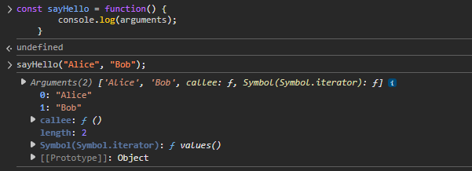

Then, even if we do not explicitly define the parameters, we can still access the arguments passed to the function using the 'arguments' object.

But, the same cannot be done with arrow functions. If we try to do the same with an arrow function, we will get an error. For example, if we write -

    const sayHello2 = () =>  console.log(arguments);
    sayHello2("Alice", "Bob");

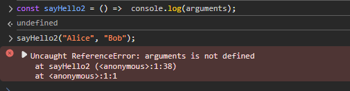

We will get an error saying 'arguments is not defined'. This is because arrow functions do not have their own 'arguments' object.

## 2. CONVERTING CALLBACK FUNCTION TO ARROW FUNCTION

Now, let's say we have a callback function. The simplest example is the 'setTimeout' function. Let's say we have the following code:

    setTimeout(function() {
        console.log("Hello after 1 second!");
    }, 1000);

This will print "Hello after 1 second!" after 1 second.

So, what if we want to convert this to an arrow function?

Well, we can do that just how we did before. We can write -

    setTimeout(() => {
        console.log("Hello after 1 second!");
    }, 1000);

And since we have only one expression in the function body, we can write it in a more concise way by removing the curly braces. So, we can write -

    setTimeout(() => console.log("Hello after 1 second!"), 1000);

There is a big gotcha with the callback functions which we will see later. But for now, we can see that we can convert the callback function to an arrow function just like we did with the anonymous function.

## 3. CONVERTING NAMED FUNCTION TO ARROW FUNCTION

These are the functions that we do not assign to a variable. Instead, they have their own name, hence they are called 'Named Functions'. For example, we have the following code:

    function greet() {
        console.log("Hello!");
    }

Here, we have a named function called 'greet'. So, how do we convert this to an arrow function?

Do we just remove the 'function' keyword and add the arrow operator? 

    greet() => {
        console.log("Hello!");
    }

Will this work?

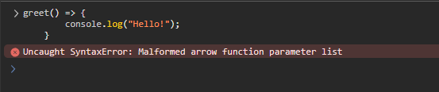

No, this will not work. We will get an error saying 'Malformed arrow function parameter list'.

So, does that mean we cannot convert named functions to arrow functions? Not exactly. The thing is, we cannot have a "named" arrow function. Arrow functions are always anonymous. So, we cannot have a named arrow function like we have a named function.

This means, we have to write -

    const greet = () => {
        console.log("Hello!");
    }

And now, we have an arrow function assigned to a variable called 'greet'.

So, what if we have a constructor function? For example, we have the following code:

    function Person(name) {
        this.name = name;
    }

Can we convert this to an arrow function and still use it as a constructor function?

    const Person = (name) => {
        this.name = name;
    };

    const person = new Person("Alice");

Well, we cannot do that. Arrow functions do not have their own 'this' context, so they cannot be used as constructor functions. If we try to do this, we will get an error saying 'TypeError: Person is not a constructor'.

We will understand this later.

## 4. CONVERTING OBJECT METHODS TO ARROW FUNCTIONS

Finally, we have the functions that are added as properties of an object. For example, we have the following code:

    const person = {
        greet: function() {
            console.log("Hello");
        }
    };

So, we can call the 'greet' method like this:

    person.greet();

What if we want to convert this to an arrow function? We can do -

    const person = {
        greet: () => {
            console.log("Hello");
        }
    };

And this works just as before. We can also make the code shorter -

    const person = {
        greet: () => console.log("Hello")
    };

So, it looks like we should use arrow functions for object methods as well, right? Well...not exactly. There is a big gotcha with arrow functions when it comes to object methods, which we will see later.

# BENEFITS OF ARROW FUNCTIONS

Of course, the biggest benefit of arrow functions is the shorter syntax. Compared to the traditional function expressions, arrow functions are more concise and easier to read.

Another benefit is that arrow functions do not have their own 'this' context. This means that they do not create a new 'this' value when they are called. Instead, they inherit the 'this' value from the surrounding code. This can be very useful in certain situations, especially when we are dealing with callbacks.

And that's the most important thing to remember about arrow functions.

# BINDING WITH 'this'

If a function does not use 'this' keyword inside it, then it is all good and fine to convert it to an arrow function because the arrow function will still behave in the same way as the regular function.

But, when there is a 'this' involved, things start to get complicated.

Let's say we have an object -

    const me = {
        name: "John",
        talk: function() {
            return this;
        },
        arrowTalk: () => {
            return this;
        }
    }

So, we have two object methods, one is a regular function and the other is an arrow function. If we call these methods like this -

    console.log(me.talk());
    console.log(me.arrowTalk());

What are we going to get? Will we get the same output?

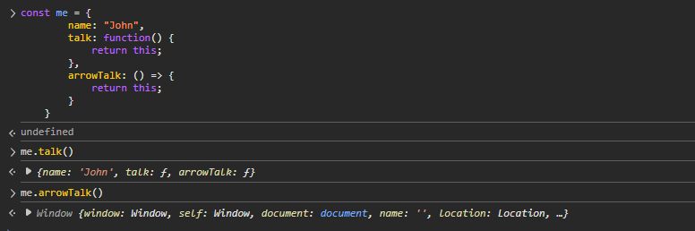

No, we will not get the same output. The first one will return the 'me' object, but the second one will return the global/window object (or undefined in strict mode).

As we saw in previous sections, when a regular function is invoked by an object, the 'this' keyword inside that function refers to that object.

But it looks like that is not the case with arrow functions.

And that's the big gotcha with arrow functions. They do not have their own 'this' context. 

This is also a use case where we should not use arrow functions. So, we should avoid using arrow functions inside objects as methods, especially when 'this' is involved.

So, how do arrow functions handle 'this'?

Well, if you look online, you will find that arrow functions do not have their own 'this'. Instead, they inherit the 'this' value from the surrounding / lexical scope where they are defined.

But, in above code, aren't we defining the arrow function inside the object? So, going by the above statement, shouldn't the 'this' keyword inside the arrow function refer to the 'me' object?

Before explaining that, ask yourself, what if we had -

    const me = {
        name: "John",
        talk: function() {
            return this;
        },
        arrowTalk: this
    }

What would happen if we called 'me.arrowTalk'?

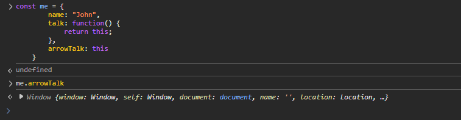

Well, the result would be 'window' ('undefined' in strict mode).

So, when we have -

    const me = {
        name: "John",
        talk: function() {
            return this;
        },
        arrowTalk: () => {
            return this;
        }
    }

So, it looks like the 'this' keyword actually refers to the global/window object inside this 'me' object. So, it makes sense that if there is an arrow function as a method inside this object, that will also have 'this' referring to the global/window object (or undefined in strict mode). Because, its surrounding scope is the global scope, not the 'me' object.

In case of arrow functions, 'this' is determined by where the arrow function is declared, not how it is called.

In case of regular functions, 'this' is determined by how the function is called. If we call it with the 'window' object, then 'this' will refer to the 'window' object. If we call it with our own object, then 'this' will refer to that object. 

But in case of arrow functions, 'this' is determined by where the arrow function is defined.

    const me = {
        arrowTalk: () => {
            return this;
        }
    };

Here, the arrow function is created at the top level (lexical scope is global or module scope), not inside a regular function or method where this would be 'me'.

Objects do not create a binding with 'this'. It is the 'functions' that do it.

So, where will the arrow functions be useful then?

Well, suppose, we have a callback function inside a regular function. Sounds confusing? Just imagine we have a 'setTimeout' inside an object's method. 

For example, we have the following code:

    const me = {
        name: "John",
        talk: function() {
            setTimeout(function() {
                console.log(`Hello, my name is ${this.name}`);
            }, 1000);
        }
    };

Well, looks like this should work as expected, right? After 1 second, it should print "Hello, my name is John".

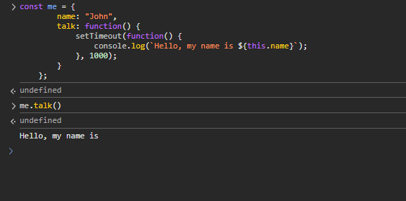

Well, it does not!

Remember that when we discussed the 'this' keyword in the previous section we understood how the callback functions are executed in an entirely different context. And we already know that in case of regular functions, 'this' is determined by how the function is called.

This means, the 'this' keyword inside the callback function will not refer to the 'me' object, but to the global/window object (or undefined in strict mode).

And that's the case here too.

Of course, one way to fix this is to use the 'bind' method to bind the 'this' keyword to the 'me' object. So, we can write -

    const me = {
        name: "John",
        talk: function() {
            setTimeout(function() {
                console.log(`Hello, my name is ${this.name}`);
            }.bind(this), 1000);
        }
    };

But, a cleaner way is to use an arrow function -

    const me = {
        name: "John",
        talk: function() {
            setTimeout(() => console.log(`Hello, my name is ${this.name}`), 1000);
        }
    };

And the reason why it works because note that here, the arrow function is inside the 'talk()' function.

When we say 'me.talk()' we know the 'this' keyword inside the 'talk()' function will refer to the 'me' object. And since the surrounding scope of the arrow function is the 'talk()' function,the 'this' keyword inside the arrow function will refer to the 'me' object as well.

And that's why this works.

Again, remember that in case of the arrow functions, 'this' is determined by where the arrow function is declared, not how it is called. Here, it is declared inside the 'talk()' function, so it refers to the 'me' object because that's the 'this' value of the 'talk()' function. And we can verify this if we console log the 'this' inside talk() function -

    const me = {
        name: "John",
        talk: function() {
            console.log(this); // This will log the 'me' object
            setTimeout(() => console.log(`Hello, my name is ${this.name}`), 1000);
        }
    };

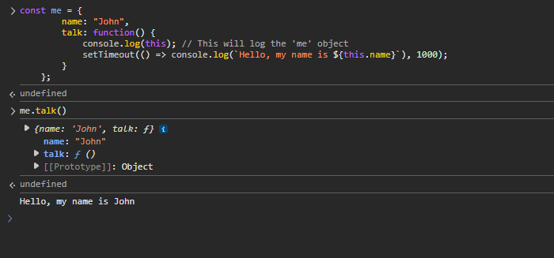

We saw that we should not use arrow functions as object methods because they do not have their own 'this' context. 

There is another place where we should not use arrow functions, and that's the methods added to the 'prototype' of a function. Remember that every function in JavaScript has a 'prototype' property, which is an object that can be used to add methods to the function. And whenever we create an instance of that function (that function will then be a Constructor Function), the instance will have access to those methods.

Let's say we create a new function called 'Person' and add two methods to its prototype:

    function Person(){}

    Person.prototype.talk = function () {
        return this;
    }

    Person.prototype.arrowTalk = () => {
        return this;
    }

So, now, let's create an instance of the 'Person' function:

    const person = new Person();

What will be the result of calling these two methods?

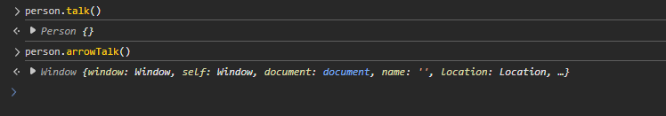

As you might have guessed, the first one will return the 'person' object, but the second one will return the global/window object (or undefined in strict mode).

What is the value of "this" where the arrow function is defined? Let's check that by writing -

    Person.prototype.test = this;

If we write 'person.test' now, then we will see that it returns the global/window object (or undefined in strict mode).

And because the 'this' keyword is pointing to the global/window object (or undefined in strict mode), when we create an arrow function, it will also point to the global/window object (or undefined in strict mode).

And because this is not the behavior we want with the methods added to the prototype of a function, we should not use arrow functions for those methods.

Finally, another place where we should not use arrow functions are the 'Event Handlers'.

In some cases, the arrow functions, if used inside event handlers, will break the intended use of 'this'. 

But wait, didn't we use the arrow functions inside the 'setTimeout' function and it worked just fine? The event handlers are also callbacks, right? So, why shouldn't we use arrow functions there?

Let's take an example.

Suppose we have this event listener on the body -

    document.body.addEventListener("click", function () {
        console.log(this);
    });

What will happen when we click on the body?

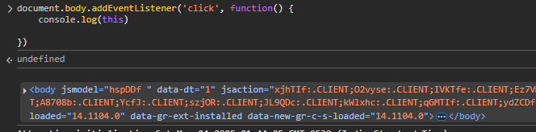

We will get the body element in the console. Makes sense. Everything working as expected.

Now, what if we use an arrow function instead of a regular function?

    document.body.addEventListener("click", () => {
        console.log(this);
    });

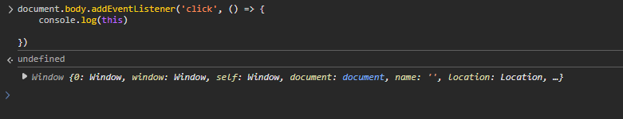

Well, now, the 'this' keyword inside the arrow function will refer to the global/window object (or undefined in strict mode).

It makes sense because the event listener is defined in the top level scope, so the 'this' keyword inside the arrow function will refer to the global/window object (or undefined in strict mode).

While this is all good, how does a regular function inside a the addEventListener work without us explicitly binding 'this' to the body element? What's the magic here?

That's all because of how the 'addEventListener' works behind the scenes. Behind the scenes, it binds the 'this' keyword to the element that the event listener is attached to. So, when we click on the body, the 'this' keyword inside the regular function refers to the 'body' element.

To understand it better, let's say we have this function that takes a callback function as an argument and calls it -

    function outer(callback) {
        callback();
    }

    function inner() {
        console.log(this);
    }

Now, if we call 'outer' function like this -

    outer(inner);

What do you think will be the output?

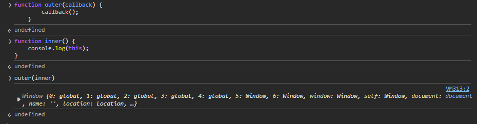

Of course, it will be the global/window object (or undefined in strict mode).

That's because the 'outer' function has nothing to bind the 'this' keyword to. So, when we call the 'inner' function, it will refer to the global/window object (or undefined in strict mode).

What if we pass an object to the 'outer' function that we should bind to 'this' -

    function outer(callback, obj) {
        callback.call(obj);
    }

    const me = {
        name: "John"
    };

    function inner() {
        console.log(this);
    }

    outer(inner, me);

Now, what would be the result?

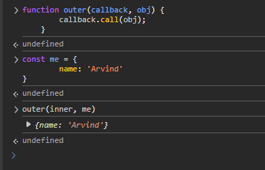

Well, now, the 'this' keyword inside the 'inner' function will refer to the 'me' object because we are explicitly binding the 'this' keyword to the 'me' object using the 'call' method.

So, whether or not the 'this' keyword inside a callback binds to some object really depends on how the outer function is handling it.

And now, this is exactly what the 'addEventListener' does behind the scenes. It binds the 'this' keyword to the element that the event listener is attached to. That's why, even if we use a regular function as a event handler callback inside addEventListener, the 'this' keyword inside the event handler refers to the element that the event listener is attached to.

This is something that does not happen with 'setTimeout' because it does not have anything to bind 'this' keyword to. And that's why in case of 'setTimeout', the regular functions do not work as intended most of the time when they use 'this' keyword.

So, that's why it is recommended to use regular functions as event handlers instead of arrow functions, so that the 'this' keyword inside the event handler refers to the element that the event listener is attached to.

# DON'T USE ARROW FUNCTIONS FOR

1. Object Methods
2. Prototypes
3. Constructor Functions
4. Event Handlers