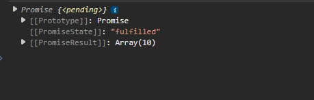

In the last section, we saw what is a "Callback Hell". The solution to this problem is to use 'Promises'. 

We saw that if we want to execute some code after a certain synchronous operation, that is pretty simple. We just write the code after the synchronous operation. Because we know that the synchronous operation will complete before the next line of code is executed.

    let weather = getWeather();
    console.log(weather);

Let's say the getWeather() is just a random function that returns a number. It does not make any HTTP calls. So, in this case, this is a synchronous operation. So, we can be sure that the console.log(weather) will execute after the getWeather() function completes.

But what if it actually makes a HTTP request to get the weather data? Then, the getWeather() function will be asynchronous.

In case of asynchronous operations, we do not know when the asynchronous operation will complete. The HTTP request may take a few milliseconds or it may take a few seconds. So, we cannot write the code that depends on the result of the HTTP request after the HTTP request. Because we do not know when the HTTP request will complete.

One way to solve it is to use callbacks. So, maybe in the function that makes the HTTP request, we can pass a callback function that will be called when the HTTP request completes.

    getWeather(callback) {
        someApiCall((weatherData) => {
            callback(weatherData);
        });
    }

    // And call it like this:

    getWeather((weather) => {
        // Some logic to handle the weather data
    });

But, as we saw in the last section, this leads to "Callback Hell". 

The solution to this problem is to use 'Promises'.

# CREATING A PROMISE

Let's first take a real world example to understand what a Promise is.

Imagine you call a pizza shop and place an order.

The promise is like the receipt they give you after ordering — it's a guarantee that you'll eventually get your pizza or a message that something went wrong.

While the pizza is being prepared, you don’t block your life (you can scroll your phone, watch Netflix — just like non-blocking JS).

Once the pizza is ready:

    - If it arrives successfully, the promise is resolved — you enjoy your pizza.

    - If the shop runs out of ingredients or the delivery fails, the promise is rejected — you get a notification (error).

This is exactly how Promises work in JavaScript.

A Promise in JavaScript is an object that represents the eventual completion (or failure) of an asynchronous operation and its resulting value.

If the operation completes successfully, the promise is 'resolved' with a value. If it fails, the promise is 'rejected' with a reason (error).

Let's say we have a function like this -

    function getWeather() {
        setTimeout(() => {
            return 'Sunny';
        }, 2000);
    }

We know that this function will return the weather data after 2 seconds. So, if we call this function like this -

    let weather = getWeather();
    console.log(weather);

This will print 'undefined'` immediately, because the function is asynchronous and it will take 2 seconds to return the weather data.

We can actually return a promise from this function. 

    function getWeather() {
        return new Promise(...);
    }

So, our getWeather function will return a Promise. It is like saying 'I promise to give you the weather data (or an error), but it will take some time'.

Now, when we create a new Promise object, it needs a function that has the asynchronous operation. 

    function getWeather() {
        return new Promise(function() {
            // Asynchronous operation goes here
        });
    }

Moreover, this function takes two parameters - One can be called if the operation is successful, and the other can be called if the operation fails. Usually, these are named 'resolve' and 'reject'.

    function getWeather() {
        return new Promise(function(resolve, reject) {
            setTimeout(() => {
                resolve('Sunny'); // Call resolve if the operation is successful
            }, 2000);
        });
    }

And now, we have converted our getWeather function to return a Promise.

# DIFFERENT STAGES OF A PROMISE

There are three stages in which a Promise in Javascript can be.

1. **Pending**: The initial state of the Promise. The operation is still ongoing, and the final value is not yet available. This is when neither resolve nor reject has been called.

2. **Fulfilled or Resolved**: The operation completed successfully, and the Promise has a resolved value. This is when the resolve function is called.

3. **Rejected**: The operation failed, and the Promise has a reason for the failure. This is when the reject function is called.

Once a promise has been fulfilled or rejected, it cannot change its state. It remains in that state forever.

# USING A PROMISE

So far, we just created a promise. But how do we use it?

At this point, the getWeather function will return a 'Promise'. How do we do some operation after the promise is resolved? Do we again pass a callback function? Well, no!

Instead, when we get the promise object from our function, we can actually use a method on this object which is named 'then'.

    const weather = getWeather();

This 'weather' variable will now point to a ; object. 

So, let's say if the weather data arrives (that is, if the promise resolves), we want to console log the weather data. We can do that by using the 'then' method on the promise object.

This method takes a callback function that will be executed when the promise is resolved.

    weather.then((weatherData) => {
        console.log(weatherData); // This will log 'Sunny' after 2 seconds
    });

And now, we have successfully used a promise to handle the asynchronous operation.

But, what if we do not get a data and maybe the asynchronous operation fails and reject is called inside the promise?

Well, one way to handle that is to pass a second argument to the 'then()' method and it is also a callback function that will be executed when the promise is rejected.

    weather.then(function(weatherData) {
            console.log(weatherData); // This will log 'Sunny' after 2 seconds
        },
        function(error) {
            console.error(error); // This will log the error if the promise is rejected
        }
    );

But this is already looking pretty ugly. 

Of course we can clean them a bit by moving the callback functions to separate functions - 

    function onSuccess(data) {
        console.log(data);
    }

    function onError(error) {
        console.error(error);
    }

And now, we can pass these functions to the 'then()' method.

    weather.then(onSuccess, onError);

Looks pretty clean, right?

# CHAINING PROMISES

One of the best features of promises is that we can chain them together.

Let's say that when we get the weather data, we want to get the icon to show based on the weather data. Let's say this is the function -

    function getWeatherIcon(weatherData) {
        return new Promise((resolve, reject) => {
            setTimeout(() => {
                switch (weatherData) {
                    case 'Sunny':
                        resolve('☀️');
                        break;
                    case 'Rainy':
                        resolve('🌧️');
                        break;
                    case 'Cloudy':
                        resolve('☁️');
                        break;
                    default:
                        reject('Unknown weather data');
                }
            }, 100);
        });
    }

This function also does some asynchronous operation and returns a promise.

So, what we want to do is, first, we want to get the weather data, and then we want to get the icon based on the weather data.

We can do that by chaining the promises together.

    getWeather()
        .then(getWeatherIcon)
        .then(onSuccess, onError);

And now, when the first promise is resolved, it will automatically call the 'getWeatherIcon' function with the weather data as the argument. And when the second promise is resolved, it will call the 'onSuccess' function with the icon as the argument. If the second promise is rejected, it will call the 'onError' function with the error as the argument.

And that's the beauty of promises. We can chain them together to create a sequence of asynchronous operations without getting into the "callback hell" situation.

# CALLBACKS VS PROMISES

If we have some logic that has callbacks like this -

    doTask1(function () {
        doTask2(function () {
            doTask3(function () {
                console.log("All tasks done");
            });
        });
    });

Promises actually make it a lot better by allowing us to write it like this -

    doTask1()
        .then(() => doTask2())
        .then(() => doTask3())
        .then(() => console.log("All tasks done")); 

So, Promises flatten the structure and improve readability.

There is als better error handling.

Since we can chain promises, if any one of the promises in the chain is rejected, the error will propagate down the chain and can be caught at the end of the chain.

    doSomething()
        .then(() => doNextThing())
        .then(() => doAnotherThing())
        .then(onSuccess, onError);

Here, if any of the promises in the chain is rejected, the error will be caught in the 'onError' function.

In case of callbacks, we would have to handle the error in each callback function separately, which can lead to a lot of repetitive code.

# CATCH

We saw that the 'then' method can take two arguments - one for the success case and one for the error case. But, to make the success and error handling separate, we can also use a method called 'catch'.

Instead of -

    getWeather()
        .then(getWeatherIcon)
        .then(onSuccess, onError);

We can do -

    getWeather()
        .then(getWeatherIcon)
        .then(onSuccess)
        .catch(onError);

So, 'catch' will only be called if any of the promises in the chain is rejected. This makes the code cleaner and separates the success and error handling logic.

But there is one more thing why we use 'catch' instead of passing the error handler as the second argument to 'then'.

Remember that 'then' will always return a new promise. It does not matter whether there is an error or not. If you have another 'then' after the first 'then', then that second then will always get called.

Let's take an example to understand this better.

    function fun1() {
        return new Promise((resolve, reject) => {
            setTimeout(() => {
                reject('Error 404!');
            }, 1000);
        });
    }

    function fun2() {
        return new Promise((resolve, reject) => {
            setTimeout(() => {
                resolved('😊');
            }, 1000);
        });
    }

    function onSuccess(data) {
        console.log('Success:', data);
    }

    function onError(error) {
        console.error('Error:', error);
    }

    fun1()
        .then(fun2)
        .then(onSuccess)
        .catch(onError);

When we run this code, the output will be -

    Error: Error 404!

This makes sense because the first promise is rejected, and the error is caught in the 'catch' block. And since the first promise itself is rejected, the function 'fun2' will never be called.

You can verify this by adding a console log inside 'fun2' to see if it gets called or not.

    function fun2() {
        console.log('fun2 called');
        return new Promise((resolve, reject) => {
            setTimeout(() => {
                resolve('😊');
            }, 1000);
        });
    }

Okay, all good so far.

What if we have a second argument to the first 'then' method, like this -

    fun1()
        .then(fun2, onError)
        .then(onSuccess)
        .catch(onError);

Here, the only change that we made was to add a second argument to the first 'then' method.

Well, ideally we should have expected the output to be -

    Error: Error 404!

But instead, the output will be -

    Error: Error 404!
    Success: undefined

Woah! This means, even though the first promise was rejected,  we still called the 'then(onSuccess)'. Remember that still, the second fun2 is not called since we do not see any console log that we had added inside 'fun2'.

But, why are we getting 'Success: undefined'?

Well, remember that 'then' always returns a new promise. This means, even though 'onError' gets called inside 'then(fun2, onError)', this 'then' still returns a new promise that is resolved with 'undefined' because 'onError' does not return anything.

If we had onError like this -

    function onError(error) {
        console.error('Error:', error);
        return 'Hello there';
    }

Then the output would have been -

    Error: Error 404!
    Success: Hello there

So, it means that 'then' will always return a new promise and that promise will be resolved with the value returned by the callback function passed to 'then'. Either it returns the value returned by the callback function for success or the callback function for error. But it does return a Promise.

And since we have a 'then(onSuccess)' after that, it will always be called with the value returned by the previous 'then' method.

There might be some situation where you want to handle the error in each then block separately but generally, it is a good practice to use 'catch' to handle errors in a single place.

Still, 'catch' does not stop the chain. If you have another 'then' after the 'catch', it will still be called. Because, just like 'then', 'catch' also returns a new promise. And that new promise will 'resolve' based on the return value of the callback inside 'catch', or 'reject' with the thrown error from this callback.

    fun1()
        .then(fun2)
        .catch(onError)
        .then(onSuccess);

So, always remember that 'catch' is simply a shorthand for 'then' with only the error handler. Behind the scenes, it still calls 'then' on the object upon which it is called but the arguments that it passes are 'undefined' for the success handler and the 'callback function' for the error handler.

But, we usually have the catch at the end of the chain to handle any errors that might occur in the entire chain.

# FINALLY

Apart from 'then' and 'catch', there is one more method that we can use with promises, and that is 'finally'.

If you know about 'try', 'catch', and 'finally' in JavaScript, then you can think of 'finally' in promises as the same thing.

This is generally used for some cleanup operation that needs to be done regardless of whether the promise was resolved or rejected. This means, the code inside 'finally' will always be executed, no matter what.

    function fun1() {
        return new Promise((resolve, reject) => {
            setTimeout(() => {
                reject('Error 404!');
            }, 1000);
        });
    }

    function fun2() {
        return new Promise((resolve, reject) => {
            setTimeout(() => {
                resolved('😊');
            }, 1000);
        });
    }

    function onSuccess(data) {
        console.log('Success:', data);
    }

    function onError(error) {
        console.error('Error:', error);
    }

    function onFinally() {
        console.log('Cleanup operation');
    }

    fun1()
        .then(fun2)
        .then(onSuccess)
        .catch(onError)
        .finally(onFinally);
     
In the above example, the 'onFinally' function will be called, despite the fact that the fun1 promise was rejected.

It is worth noting that the callback passed to the 'finally' method does not receive any arguments. This makes sense because 'finally' does not case whether the promise was rejected or resolved with any value. It is simply used for cleanup or final operations that need to be executed regardless of the promise's outcome.

Just like 'then' and 'catch', 'finally' also returns a new promise.This means, you can chain it with 'then' or 'catch' after it. If the 'onFinally' throws an error or returns a rejected promise, the new promise that 'finally' returns will be rejected with that value. Otherwise, the new promise will settle with the same state as the current promise.

If that was hard to understand, take this example - 

    Promise.resolve(2)
        .then(
            () => 77, 
            () => {}
        )
        .then((data) => console.log(data));

Here, we have a promise that is resolved with the value '2'. The first callback in 'then' will be called and it will return 77. This first 'then' eventually returns a new promise that is resolved with the value '77'. That's why, the second 'then' gets '77' as the 'data' and logs it.

What if we have -

    Promise.resolve(2)
        .finally(() => 77)
        .then((data) => console.log(data));

Here, we have a promise that is resolved with the value '2'. The 'finally' method will be called and despite the fact that it returns '77', the 'new' promise that 'finally' returns will be resolved with the same value as the original promise, which is '2'. And that's why, the 'then' method gets '2' as the 'data' and logs it.

This is a big difference between 'then' and 'finally'.

If we 'throw' some error in the 'finally' method or we return a rejected promise, then the new promise that 'finally' returns will be rejected with that value.

    Promise.resolve(2)
        .finally(() => {
            throw new Error('Something went wrong');
        })
        .then((data) => console.log(data))
        .catch((error) => console.error("Error is", error));

Here, the Promise resolves with the value '2', but the 'finally' method throws an error. So, the new promise that 'finally' returns will be rejected with that error. And that's why, the 'catch' method gets the error and logs it.

Same is the case if we have -

    Promise.resolve(2)
        .finally(() => {
            return Promise.reject('Something went wrong');
        })
        .then((data) => console.log(data))
        .catch((error) => console.error("Error is", error));

# REAL WORLD USE OF PROMISES WITH 'FETCH'

In JavaScript we can make HTTP requests using the 'fetch' API.

We have a 'fetch' function that takes a URL as an argument and returns a Promise that resolves to the Response object representing the response to the request.

This is a good example of how we can use Promises in real world applications.

For example, we have this URL to which we want to make a GET request to get the data -

    https://jsonplaceholder.typicode.com/users

This will return us a list of users.

So, how can we get this data? 

Well, we can use the 'fetch' function and pass this URL in that.

    fetch('https://jsonplaceholder.typicode.com/users');

If you just run this code, this will make an API call and you can see that in your browser's network tab.

But this will not give us the data.

What does this give us? Let's console log that -

    console.log(fetch('https://jsonplaceholder.typicode.com/users'));

If you do this, it will log a 'Promise' object. This means, 'fetch' method returns a Promise. And as we already learned, we can use 'then', 'catch' and 'finally' methods on this Promise object.

Let's try to get the data from this Promise.

    fetch('https://jsonplaceholder.typicode.com/users')
        .then(data => console.log(data));

If we do this, this will console log a new 'Response' object. This won't console log the data directly. That's interesting!

To get the actual data, we have to call the 'json()' method on this Response object.

So, what if we do -

    fetch('https://jsonplaceholder.typicode.com/users')
        .then(data => console.log(data.json()));

Oh, now, we see that it console logs a Promise again. This is because the 'json()' method also returns a Promise that resolves to the actual data.
    
And as we already learned, we can now chain a 'then' method to this second Promise to get the actual data.

    fetch('https://jsonplaceholder.typicode.com/users')
        .then(response => response.json())
        .then(data => console.log(data));

And boom! Now, we get the actual data in the console which is a list of users.

Let's maybe also add a 'catch' method to handle any errors that might occur while fetching the data.

    fetch('https://jsonplaceholder.typicode.com/users')
        .then(response => response.json())
        .then(data => console.log(data))
        .catch(error => console.error('Error fetching data:', error));

Imagine if the server is down or the URL is incorrect, this will catch the error and log it to the console.

And that's all about the Promises in JavaScript! Of course this is just the tip of the iceberg. There are many more things that we can do with Promises but this is the basic understanding that you need to get started with Promises.