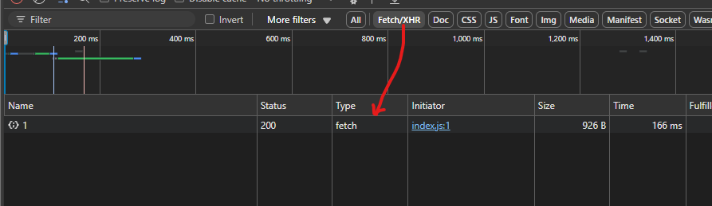

There is a built-in API that allows you to make HTTP requests in JavaScript. This API is called the 'Fetch' API.

Before 'Fetch', we used to use the 'XMLHttpRequest' to make HTTP requests. The 'fetch' API is a modern replacement for 'XMLHttpRequest' and provides a more powerful and flexible feature set.

'Fetch' is a promise-based API, which means it returns a promise that resolves to the response of the request. This makes it easier to work with asynchronous code. And since we have already learned about promises and async/await, we can use them with the 'fetch' API.

The most common way to use 'fetch' is by passing the URL of the resource you want to fetch as the first argument. There is also an optional second argument that allows you to specify options for the request, such as the HTTP method, headers, and body. We will see more about these options later.

So, the most basic usage of 'fetch' looks like this:

    fetch('https://api.example.com/data');

# REQUEST OBJECT

Instead of a string, you can also pass a 'Request' object as the first argument.

For example -

    const request = new Request('https://api.example.com/data');
    fetch(request);

This is going to behave the same as -

    fetch('https://api.example.com/data');

So, when you pass a simple URL string to the 'fetch' function, JavaScript automatically creates a 'Request' object for you behind the scenes.

As a result of calling this function, we get a promise that resolves to a 'Response' object. This 'Response' object contains information about the response, such as the status code, headers, and body.

Now, just like the 'Response' object, the 'Request' object has other properties like the HTTP method, headers, and body. You can see that if you console log the request object -

    const request = new Request('https://jsonplaceholder.typicode.com/posts/1');

    console.log('Request:', request);

You will see something like this in the console -

    Request: Request {
        method: 'GET',
        url: 'https://jsonplaceholder.typicode.com/posts/1',
        headers: Headers {},
        destination: '',
        referrer: 'about:client',
        referrerPolicy: '',
        mode: 'cors',
        credentials: 'same-origin',
        cache: 'default',
        redirect: 'follow',
        integrity: '',
        keepalive: false,
        isReloadNavigation: false,
        isHistoryNavigation: false,
        signal: AbortSignal { aborted: false }
    }

So, we can see that even though we passed a simple URL string to the 'fetch' function, it created a 'Request' object for us behind the scenes. And we can access the properties of this 'Request' object.

By default, 'fetch' will always make a 'GET' request. That's why the method property of the 'Request' object is set to 'GET'. Similarly, many other properties are set to their default values if not specified.

# RESPONSE OBJECT

Just like the 'Request' object, the 'Response' object also has properties that contain information about the response. 

To see this in action, let's make a request to a URL and log the response object to the console. Since 'fetch' returns a promise, we can use the 'then' method to handle the response.

    fetch('https://jsonplaceholder.typicode.com/posts/1')
        .then(response => {
            console.log('Response:', response);
        });

When you run this code, you will see something like this in the console:

    Response: Response {
        status: 200,
        statusText: 'OK',
        headers: Headers {
            date: 'Tue, 10 Jun 2025 16:29:13 GMT',
            'content-type': 'application/json; charset=utf-8',
            'transfer-encoding': 'chunked',
            connection: 'keep-alive',
            server: 'cloudflare',
            'report-to': '{"group":"heroku-nel","max_age":3600,"endpoints":[{"url":"https://nel.heroku.com/reports?ts=1746021932&sid=e11707d5-02a7-43ef-b45e-2cf4d2036f7d&s=LCVcES7k4wrtsCIlDAqxRzPgwJ3Agq2beOSDbO2JZF4%3D"}]}',
            'reporting-endpoints': 'heroku-nel=https://nel.heroku.com/reports?ts=1746021932&sid=e11707d5-02a7-43ef-b45e-2cf4d2036f7d&s=LCVcES7k4wrtsCIlDAqxRzPgwJ3Agq2beOSDbO2JZF4%3D',
            nel: '{"report_to":"heroku-nel","max_age":3600,"success_fraction":0.005,"failure_fraction":0.05,"response_headers":["Via"]}',
            'x-powered-by': 'Express',
            'x-ratelimit-limit': '1000',
            'x-ratelimit-remaining': '999',
            'x-ratelimit-reset': '1746021941',
            vary: 'Origin, Accept-Encoding',
            'access-control-allow-credentials': 'true',
            'cache-control': 'max-age=43200',
            pragma: 'no-cache',
            expires: '-1',
            'x-content-type-options': 'nosniff',
            etag: 'W/"124-yiKdLzqO5gfBrJFrcdJ8Yq0LGnU"',
            via: '1.1 vegur',
            age: '3534',
            'cf-cache-status': 'HIT',
            'content-encoding': 'br',
            'cf-ray': '94da3f109b3b989e-MRS',
            'alt-svc': 'h3=":443"; ma=86400'
        },
        body: ReadableStream { locked: false, state: 'readable', supportsBYOB: true },
        bodyUsed: false,
        ok: true,
        redirected: false,
        type: 'basic',
        url: 'https://jsonplaceholder.typicode.com/posts/1'
    }

# json() METHOD

So, there is a lot of information in the 'Response' object. One thing worth mentioning is that we do not directly get the data from the API call. Instead, we get a 'Response' object. This 'Response' object has a 'body' property which, as we can see above, is a 'ReadableStream'. This means that the data is not immediately available, and we need to read it from the stream.

And we do that by using the 'json' method of the 'Response' object. Note that even though this method is named 'json' it does not return a JSON but rather it returns the result of taking a JSON as input and parsing it to return a JavaScript object.

Most modern APIs send data in JSON format (e.g., { "name": "John" }). To convert the raw response body into a usable JavaScript object, we use the 'json()' method. This reads the body as a 'stream', decodes it as text, then parses it as JSON and returns a JavaScript object.

The return value of 'json()' method is a promise which resolves to the parsed JSON data.

And this is the reason why when we use 'fetch', we have to use 'then' two times to get the actual data from the response. Something like this:

    fetch('https://jsonplaceholder.typicode.com/posts/1')
        .then(response => response.json())
        .then(data => {
            console.log('Data:', data);
        });

When you run this code, you will see the actual data from the API in the console. The first 'then' method gets the 'Response' object and calls the json() method on it to return another promise, and the second 'then' method gets the actual data.

We can use async/await syntax as well to make it look cleaner:

    const url = 'https://jsonplaceholder.typicode.com/posts/1';

    async function getData() {
        const response = await fetch(url);
        const data = await response.json();
        console.log(data);
    }

    getData();

Just like 'json', we also have other methods like -

    - 'text()': to read the response body as text.
    - 'blob()': to read the response body as a Blob.
    - 'formData()': to read the response body as FormData.
    - 'arrayBuffer()': to read the response body as an ArrayBuffer.

# REQUEST PARAMETERS

Some APIs require some additional parameters to be passed in the request, such as headers, body, and HTTP method.

For example, an API might want you to provide an API key in the headers or send some data in the body of the request.

When we work with APIs, we do not always just make a simple 'GET' request to some URL like 'abc.com/api'. We often need specific information and for that, we need to pass some parameters in the request.

Let's say we have a music api and we want to get data about some alums by some specific artist before the year 2000. This is a pretty specific request and we need to pass some parameters in the request to get the desired data.

Our URL might look something like this:

    https://musicapi.com/api?type=albums&artist=John+Doe&beforeYear=2000

So here, we are passing three parameters in the URL:

    - 'type': to specify that we want albums.
    - 'artist': to specify the artist name.
    - 'beforeYear': to specify that we want albums before the year 2000.

These type of parameters are called 'query parameters' and they are appended to the URL after a '?' character. Multiple query parameters are separated by '&' character.

This is pretty straightforward and we can just pass this URL to the 'fetch' function like this:

    fetch('https://musicapi.com/api?type=albums&artist=John+Doe&beforeYear=2000');

If we want the parameters to be dynamic, we can use template literals to construct the URL:

    const type = 'albums';
    const artist = 'John Doe';
    const beforeYear = 2000;

    fetch(`https://musicapi.com/api?type=${type}&artist=${artist}&beforeYear=${beforeYear}`);

# HEADERS

Sometimes, we want to send some additional information in the request, such as authentication tokens or content type. We cannot use query parameters for this, maybe because the API does not support it or we just want to keep the URL clean. In such cases, we can use headers.

Moreover, headers are not saved in the browser history or shown in the URL, so they are not visible to the user. This is useful for sensitive information like authentication tokens. e.g. an API key or a JWT token.

And for this case, we have to explicitly create a request object and pass it to the 'fetch' function. This is because we need to specify the headers in the request object.

Let's say we want to use the Spotify API to get some data. Let's say the URL is -

    https://api.spotify.com/v1/artists/0k17h0D3J5VfsdmQ1iZtE8

What will happen if we try to fetch this URL directly?

    fetch('https://api.spotify.com/v1/artists/6eUKZXaKkcviH0Ku9w2n3V');

You will notice something like this as the response -

    {
        "error": {
            "status": 401,
            "message": "No token provided"
        }
    }

Here, the status code is 401 which means "Unauthorized". This is because the Spotify API requires an authentication token to be passed in the request headers. That's why we are getting this error.

If you head over to the Spotify API documentation, you will see that it requires an 'Authorization' header with a 'Bearer' token. This is a common way to authenticate API requests.

So, first we need to login to the Spotify API and get an access token. Once we have the access token, we can pass it in the request headers.

Here is the URL to learn about how to get the access token:

    https://developer.spotify.com/documentation/web-api/quick-start/

Let's say the access token is '1234xyz'. Now, we have to pass it as a 'Request Header' in the request. We can do this by creating a 'Request' object and passing the headers in it.

    const url = 'https://api.spotify.com/v1/artists/6eUKZXaKkcviH0Ku9w2n3V';

    async function getData() {
        const request =  new Request(url, {
            method: 'GET',
            headers: {
                Authorization: `Bearer ${accessToken}`
            }
        });

        const response = await fetch(request);
        const data = await response.json();
        console.log(data);
    }

Here, we are creating a 'Request' object and passing the URL, HTTP method, and headers in it. The 'Authorization' header contains the access token that we got from the Spotify API.

If the access token is valid, we will get the data in the response. If the access token is invalid or expired, we will get an error.

We will get some data like this -

    {
        external_urls: { spotify: 'https://open.spotify.com/artist/6eUKZXaKkcviH0Ku9w2n3V' },
        followers: { href: null, total: 120795323 },
        genres: [ 'soft pop' ],
        href: 'https://api.spotify.com/v1/artists/6eUKZXaKkcviH0Ku9w2n3V?locale=*',
        id: '6eUKZXaKkcviH0Ku9w2n3V',
        images: [
            {
                url: 'https://i.scdn.co/image/ab6761610000e5eb399444ed4eace08b549d1161',
                height: 640,
                width: 640
            },
            {
                url: 'https://i.scdn.co/image/ab67616100005174399444ed4eace08b549d1161',
                height: 320,
                width: 320
            },
            {
                url: 'https://i.scdn.co/image/ab6761610000f178399444ed4eace08b549d1161',
                height: 160,
                width: 160
            }
        ],
        name: 'Ed Sheeran',
        popularity: 91,
        type: 'artist',
        uri: 'spotify:artist:6eUKZXaKkcviH0Ku9w2n3V'
    }

# ERROR HANDLING

We saw above when we did not have an access token we got this response -

    {
        "error": {
            "status": 401,
            "message": "No token provided"
        }
    }

But, if you think about it, this is not exactly an error. This is a valid response data and that's why we were able to console log the response data. 

To be more clear, let's change our async await logic and instead go back to the old 'then' and 'catch' to see where the code goes in case of a wrong api call -

    function getData() {
        const request =  new Request(url, {
            method: 'GET',
            headers: {
                Authorization: `Bearer 1234`
            }
        });

        return fetch(request);
    }

    getData()
        .then(response => response.json())
        .then(data => console.log('Data:', data))
        .catch(error => console.error('Error:', error));

So here, we are explicitly passing a wrong access token '1234' to the API. When we run this code, we will see that the 'then' block is executed and we get the response data in the console.

    Data: { error: { status: 401, message: 'Invalid access token' } }

So, it means that the 'fetch' API is not rejecting the promise here, even though there is an error in the response. Instead, it is resolving the promise with the response object that contains the error information.

And this is an important point to note. The 'fetch' API does not reject the promise for HTTP errors (like 404, 500, etc.). It only rejects the promise for network errors (like no internet connection, DNS lookup failure, invalid url etc.).

So, if we explicitly want to make sure  that we handle HTTP errors, we need to then look into the 'Response' object that we get in the first 'then' block.

If we print the response in the console, it would be like this -

    Response {
        status: 401,
        statusText: 'Unauthorized',
        headers: Headers {
            'www-authenticate': 'Bearer realm="spotify", error="invalid_token", error_description="Invalid access token"',
            'access-control-allow-origin': '*',
            'access-control-allow-headers': 'Accept, App-Platform, Authorization, Content-Type, Origin, Retry-After, Spotify-App-Version, X-Cloud-Trace-Context, client-token, content-access-token',
            'access-control-allow-methods': 'GET, POST, OPTIONS, PUT, DELETE, PATCH',
            'access-control-allow-credentials': 'true',
            'access-control-max-age': '604800',
            'content-type': 'application/json',
            'content-encoding': 'gzip',
            'strict-transport-security': 'max-age=31536000',
            'x-content-type-options': 'nosniff',
            'alt-svc': 'h3=":443"; ma=2592000,h3-29=":443"; ma=2592000, h3=":443"; ma=2592000,h3-29=":443"; ma=2592000',
            date: 'Fri, 13 Jun 2025 16:35:31 GMT',
            server: 'envoy',
            via: 'HTTP/2 edgeproxy, 1.1 google',
            'transfer-encoding': 'chunked'
        },
        body: ReadableStream { locked: false, state: 'readable', supportsBYOB: true },
        bodyUsed: false,
        ok: false,
        redirected: false,
        type: 'basic',
        url: 'https://api.spotify.com/v1/artists/6eUKZXaKkcviH0Ku9w2n3V'
    }

Note that the 'status' property is set to 401 and the 'ok' property is set to false. These two are the main properties that we can use to check if the response is valid or not.

Now that we know all this, let's go back to the async/await syntax and handle the errors properly.

    async function getData() {
        const request =  new Request(url, {
            method: 'GET',
            headers: {
                Authorization: `Bearer ${accessToken}`
            }
        });

        try {
            const response = await fetch(request);
            const data = await response.json();

            if (response.status === 200) {
                console.log('Success:', data);
            } else {
                console.log('Server Error', data.error.message)
            }
            
        } catch (error) {
            console.error('Error fetching data:', error);
        }
        
    }

    getData();

Here,  we are using a try-catch block to handle any network errors that might occur while fetching the data. If the fetch is successful, we check the status of the response. If it is 200, we log the data, otherwise we log the error message from the response.

Remember that the 'fetch' API does not reject the promise for HTTP errors, so we have to check the status of the response manually. That's why, the 'catch' block above will only catch network errors, not HTTP errors.

# MORE ON FETCH API

So far, we have only seen how to make a 'GET' request using the 'fetch' API. But we can also make other types of requests like 'POST', 'PUT', 'DELETE', etc.

There are also other things like 

You can read more on MDN:

    https://developer.mozilla.org/en-US/docs/Web/API/Fetch_API/Using_Fetch

# XMLHttpRequest

Before 'fetch', the main way to  make HTTP requests in JavaScript was using the 'XMLHttpRequest' object. It is an older API and is not as easy to use as the 'fetch' API. However, it is still used in many applications.

It was based on 'callbacks' and did not support promises or async/await syntax. So, there was the 'callback hell' problem where you had to nest multiple callbacks to handle the response.

Just look at this example of making a 'GET' request using 'XMLHttpRequest':

    const xhr = new XMLHttpRequest();
    xhr.open('GET', 'https://jsonplaceholder.typicode.com/posts/1', true);
    xhr.onload = function() {
        if (xhr.status >= 200 && xhr.status < 300) {
            console.log('Response:', JSON.parse(xhr.responseText));
        } else {
            console.error('Error:', xhr.statusText);
        }
    };
    xhr.onerror = function() {
        console.error('Network Error');
    };
    xhr.send();

A neat little detail about browser's network tab is that it shows 'Fetch/XHR' for the Http requests made using the 'fetch' API or 'XHR'.

So, if we make the same  request using the 'fetch' API, it will show 'fetch' as its type: 

    fetch('https://jsonplaceholder.typicode.com/posts/1')
        .then(response => response.json())
        .then(data => console.log('Data:', data))
        .catch(error => console.error('Error:', error));

Anyways, when it comes to making HTTP requests in JavaScript, the 'fetch' API is the modern way to do it. It is easier to use, supports promises and async/await syntax, and is more powerful than 'XMLHttpRequest'.