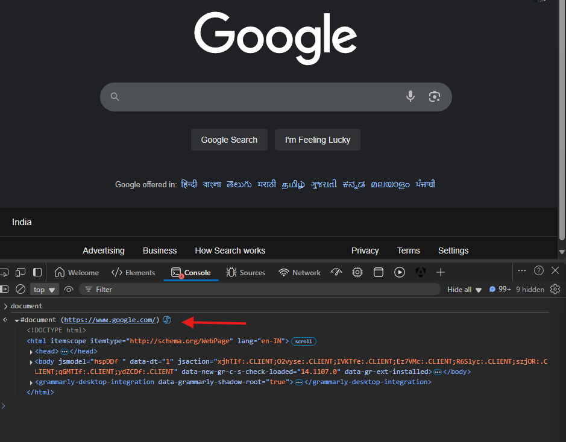
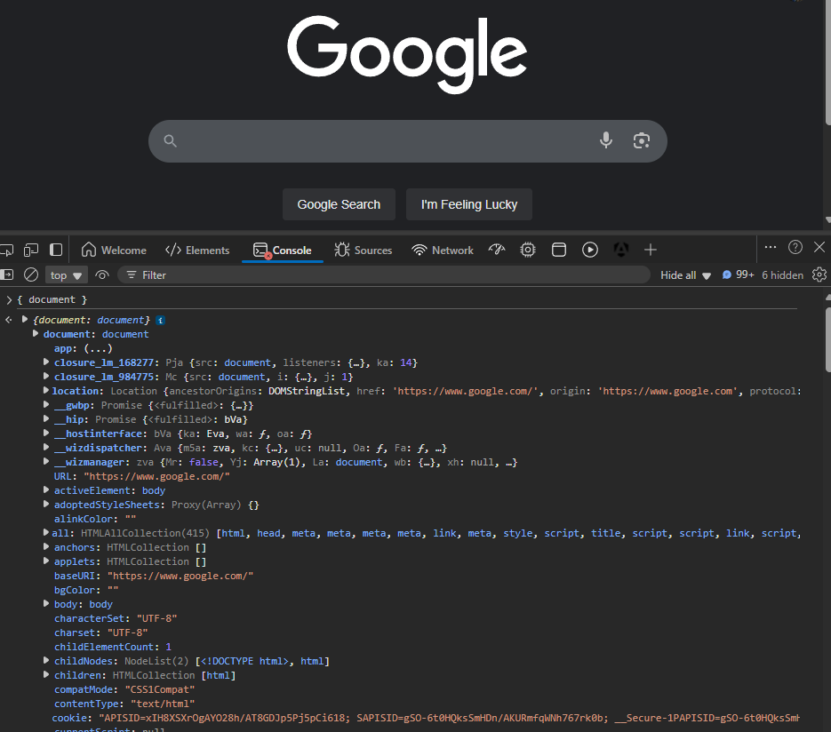
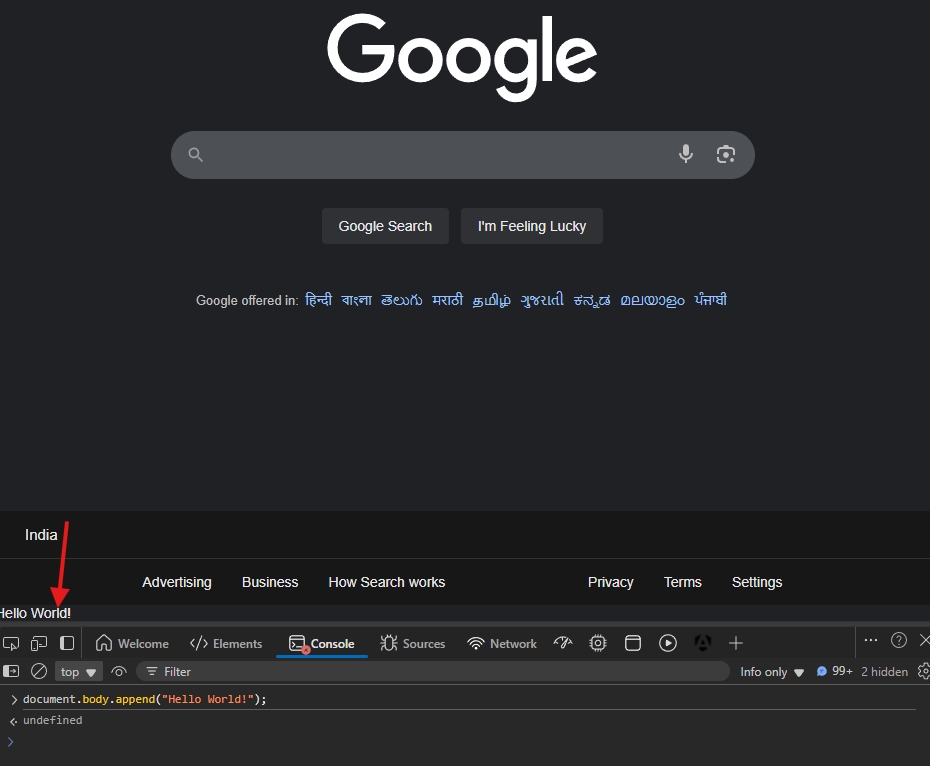
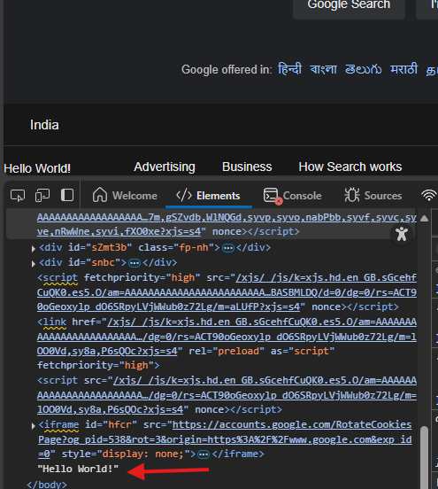
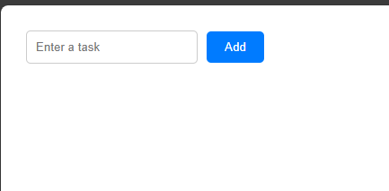
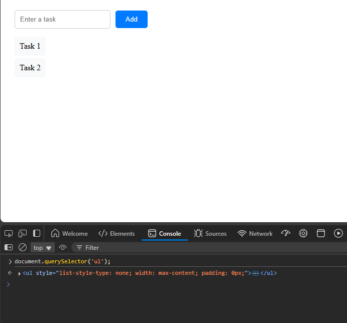
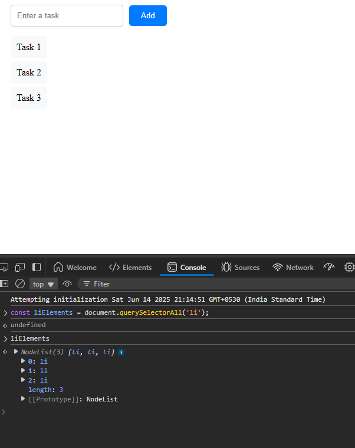

DOM stands for 'Document Object Model', which is a programming interface for web documents.

DOM represents the page as a 'tree structure' where each node is an object representing a part of the document like elements, attributes, and text.

For example, if we have an HTML like -

    <body>
        <h1>Hello</h1>
        
World

    </body>

This eventually  gets represented in the DOM as a tree structure like this:

    Document
        └── html
                └── body
                    ├── h1
                    └── p

And as you might have guessed, the DOM API is something that lets us interact with this tree structure programmatically. It provides set of methods and properties to manipulate the structure, style, and content of the document.

If you head over to MDN, you will see that the 'DOM' actually has a lot of interfaces.

https://developer.mozilla.org/en-US/docs/Web/API/Document_Object_Model

You will see interfaces like 'Document', 'Element', 'Node', 'HTMLCollection', etc.

# THE 'DOCUMENT' INTERFACE

The most commonly used interface is the 'Document' interface. This interface represents any web page that is loaded in the browser and this is like an entry point to the content of the webpage, which is the DOM tree.

In JavaScript, we can use the 'document' object to manipulate the DOM. And this 'document' object is an implementation of the 'Document' interface.

If you open the console in your browser and type `document`, you will see that it will return the entire HTML of the page that you are currently on.

To see the actual 'document' object, we can type this in the console -

    { document }

This will return the 'document' object, which is an instance of the 'Document' interface.

And you will see a lot of properties and methods that we can use.

For example, maybe we want to console log something when we click the page we are currently on. Well, we can use the 'onclick' property of the 'document' object to do that.

We just need to assign a function to the 'onclick' property like this:

    document.onclick = () => console.log("Yay! You clicked!");

And now, if you click anywhere on the page, you will see "Yay! You clicked!" in the console.

You will also see that there are separate properties for the 'head' and 'body' of the document, which you can use to manipulate those parts of the document.

And there are things like 'children' under 'body' property which will give you a collection of all the child elements of the body.

Want to access the HTML of the body? Well, there is an 'innerHTML' property for that.

So, if we can access all these, it should mean we can also modify them, right? Yes, we can!

Let's maybe try to add a text at the end of the body. We can use the 'append' method for that like this -

    document.body.append("Hello World!");

And this will add "Hello World!" at the end of the body.

We can actually see this text in the 'Elements' tab as well.

# ADDING NEW ELEMENTS

Let's say we want to add a new element to the body. First, we have to create a new element. And as you might have guessed, we have a method for that as well.

If you search for a method named 'createElement' in the 'document' object, you will find it.

The syntax of this method is pretty simple. We just need to pass the name of the element we want to create as a string. It also takes an optional second argument which is an object containing properties to set on the element. But for now , we will just use the first argument.

This method returns a new element of the type specified by the tag name. This new element is of type 'HTMLElement' is the document is an HTML document (which is the most common case). Otherwise, it returns a new 'Element'.

So, let's say we want to create a new 'p' element. We can do that like this:

    const newElement = document.createElement("p");

If we console log this 'newElement', it will be like this -

    

Again, we can see the actual object by typing this in the console:

    { newElement }

And you will see that it has a lot of properties and methods that we can use to manipulate this element.

Let's say we want to change the text of this element. For that, there is a property called 'textContent' that we can use.

    newElement.textContent = 'Hello World';

Now, if you print this 'newElement' again, you will see that the text has changed to "Hello World".

    
Hello World

Now let's add this new element at the end of the 'body'. For that, we can use the 'append' method of the 'body' element.

    document.body.append(newElement);

And now, if you check the 'Elements' tab, you will see that the new 'p' element has been added at the end of the body.

It is worth mentioning that if you try to write -

    document.append(newElement);

This will not work. Yes, there is an 'append' method on the 'document' object, but still, we see an error saying -

    VM1046:1 Uncaught HierarchyRequestError: Failed to execute 'append' on 'Document': Only one element on document allowed.
    at <anonymous>:1:10

This is because the 'append' method on the 'document' object is used to append nodes to the document itself, not to the body. And as the error message says, only one element is allowed on the document. That one element is the 'html' element, which is the root element of the document. And so, it makes sense  that we cannot append anything to the document itself.

So, that's one thing to keep in mind. We can only append elements to the 'body' or 'head' of the 'document', not to the 'document' itself.

# A SMALL TO-DO APP WITH ALL WE LEARNED

Now that we know how to create and manipulate elements, let's build a small to-do app with what we learned.

We basically want an input element, and a button to add the input value as a new to-do. When we enter some value in the input and click the button, we want to add a new element to the body with that value.

    const input = document.createElement('input');
    input.placeholder = 'Enter a task';

    const button = document.createElement('button');
    button.textContent = 'Add';

    document.body.appendChild(input);
    document.body.appendChild(button);

    button.addEventListener('click', () => {
        const div = document.createElement('div');
        div.textContent = input.value;
        document.body.appendChild(div);
        input.value = '';
    });

So, in the above code, we first create an input element and a button element. We set the placeholder of the input to "Enter a task" and the text of the button to "Add".

Then, we append both the input and the button to the body.

Finally, we add an event listener to the button that creates a new 'div' element with the value of the input when clicked, appends it to the body, and clears the input value.

This was simple, right? We just used the 'createElement', 'appendChild', and 'textContent' properties to create and manipulate elements.

# SEMANTIC HTML

While the code we wrote works, it is not the best way to create a to-do app. The reason is that we are using a 'p' element to represent a to-do item, which is not semantically correct.

We should always try to use semantic HTML elements to represent the content of the page. Semantic HTML elements are those that have a meaning and describe the content they contain.

The examples include 'header', 'footer', 'nav', 'article', 'section', 'aside', etc. 

Moreover, when we have an input field and a button to submit the input, we should use a 'form' element to wrap them. This is because a 'form' element is used to collect user input and submit it to a server.

So, let's create a new 'form' element first and then add it to the body - 

    const form = document.createElement('form');
    document.body.appendChild(form);

Now, we can create a new 'input' element  and a 'button' element and append them to the form instead of the body.

    const input = document.createElement('input');
    input.placeholder = 'Enter a task';
    input.name = 'task';

    form.appendChild(input);

    const button = document.createElement('button');
    button.textContent = 'Add';
    button.type = 'button';

    form.appendChild(button);

Note how we are setting the 'name' attribute of the input to 'task'. This is a good practice because it helps us identify the input when we submit the form.

Instead of random divs for the tasks, we will create a new 'ul' element to have a list of tasks added.

    const ul = document.createElement('ul');
    form.appendChild(ul);

Now that we have a 'form' element, we know that clicking the button basically means we want to submit the data that is in the form. So, we can use the 'onsubmit' property of the 'form' to handle the submissions.

    form.onsubmit = () => {
        const li = document.createElement('li');
        li.textContent = input.value;
        ul.appendChild(li);
        input.value = '';
    }

There is one thing we need to add here. If we run this code, then when you click the button, it will refresh the page. This is because when a form is submitted, the browser typically reloads the page or navigates to a different URL.

To prevent this, we can use the 'preventDefault' method of the 'event' object that is passed to the 'onsubmit' function.

    form.onsubmit = (event) => {
        event.preventDefault();
        const li = document.createElement('li');
        li.textContent = input.value;
        ul.appendChild(li);
        input.value = '';
    }

And now, our To-Do app is complete!

We can now also submit the task by pressing the 'Enter' key because the 'form' element will automatically handle that for us. This was not possible before automatically because we were just using a button without a form.

# REMOVE ELEMENTS

So far, we have only added elements to the DOM. But what if we want to remove an element from the DOM? Well, we have a method for that as well.

Let's say when we click any list element, we want to remove it from the list. Well, we can add an event listener to the 'li' elements that we create and use the 'remove' method to remove the element from the DOM.

    form.onsubmit = (event) => {
        event.preventDefault();
        const li = document.createElement('li');
        li.textContent = input.value;
        li.onclick = () => li.remove(); <== HERE
        ul.appendChild(li);
        input.value = '';
    }

Every element has a 'remove' method on it that removes the element from the DOM. So, when we click on any 'li' element, it will remove itself from the list.

It is also a better practice to maybe create a separate method to remove an element from the DOM. So, we can create a function like this:

    const removeElement = el => el.remove();

And then  we can use this function in the 'onclick' event of the 'li' element like this:

    li.onclick = removeElement(li);

But this won't work because onclick expects us to pass a reference to the function, not the return value. In the above line, we are actually calling the function immediately and passing the return value to the 'onclick' event.

One way is to  use an arrow function to call the 'removeElement' function like this:

    li.onclick = () => removeElement(li);

Another way is to use the 'bind' method which we learned earlier.

    li.onclick = removeElement.bind(null, li);

And well, that's how we can remove elements from the DOM.

# STYLING AND ATTRIBUTES

So, how do we add some styles to the elements we create?

If we console log the 'document.body' then we will see that it has a 'style property which is an object that contains all the styles applied to the body.

And this is a property that every element has. So, we can use this property to add styles to the elements we create. Of course we should ideally use a separate CSS file for styling (except for any specific cases), but we can also add styles directly using JavaScript.

Let's maybe add some padding to the body element.

    document.body.style.padding = '20px';

Maybe let's style the 'input' element now as well

    input.style.padding = '10px';
    input.style.border = '1px solid #ccc';
    input.style.borderRadius = '5px';
    input.style.marginRight = '10px';

That's cool!

Maybe now let's style the button as well.

    button.style.padding = '10px 20px';
    button.style.backgroundColor = '#007bff';
    button.style.color = '#fff';
    button.style.border = 'none';
    button.style.borderRadius = '5px';
    button.style.cursor = 'pointer';

And now, our todo app looks much better!

Let's also add some styles to the 'ul' element to make it look better.

    ul.style.listStyleType = 'none';
    ul.style.width = 'max-content';
    ul.style.padding = '0';

Finally, maybe also style the 'li' elements to have some background and padding inside -

    li.style.backgroundColor = '#f8f9fa';
    li.style.padding = '10px';
    li.style.marginBottom = '5px';
    li.style.borderRadius = '5px';
    li.style.cursor = 'pointer';

Maybe also some hover effect to the 'li' elements to make them look better when hovered over.

    li.onmouseover = () => li.style.backgroundColor = '#e9ecef';
    li.onmouseout = () => li.style.backgroundColor = '#f8f9fa';

That's how we can programmatically style elements using JavaScript.

To add attributes to elements, we can use the 'setAttribute' method. This method takes two arguments - the name of the attribute and the value of the attribute.

Let's say we want to add a 'class' attribute to the 'body' element. We can do that like this:

    document.body.setAttribute('class', 'dark');

And now, if you inspect the body element in the 'Elements' tab, you will see that it has a 'class' attribute with the value 'dark'.

# QUERY THE DOM

So far, we have been using the 'document' object to create and manipulate elements. But what if we want to select an existing element from the DOM? 

Let's go back to our to-do app and say we want to select the 'ul' element that we created. We can use the 'querySelector' method of the 'document' object for that.

The 'querySelector' method takes a CSS selector as an argument and returns the first element that matches the selector.

If you do not know what a CSS selector is, it is basically a way to select elements in the DOM using their tag name, class, id, or any other attribute.

For example, in CSS, if we  want to select all the 'p' elements, we can use the 'p' selector. If we want to select an element with a specific class, we can use the '.' followed by the class name. And if we want to select an element with a specific id, we can use the '#' followed by the id name.

We have to pass the same selector as a string  to the 'querySelector' method to select the element.

Let's say we want to select the 'ul' element that we created. We can do that like this:

    const ul = document.querySelector('ul');

This will return the first 'ul' element in the document. If there are multiple 'ul' elements, it will return the first one. If no element matches the selector, it will return 'null'.

It is worth mentioning that you can pass any complex CSS selector to the 'querySelector' method. For example - 

    const el = document.querySelector("div.user-panel.main input[name='login']");

Maybe we want to select the first input element with the name attribute 'login' inside a 'div' element with the classes 'user-panel' and 'main'.

Similarly, let's also select the 'li' elements inside the 'ul' element that we created.

    const liElements = document.querySelector('li');

You will see that this only returns the first 'li' element. If you want to select all the 'li' elements, you can use the 'querySelectorAll' method instead.

    const liElements = document.querySelectorAll('li');

This will return something called a 'NodeList', which is a collection of all the elements that match the selector.

There are other methods to query the DOM. For example, if we want to select all the elements that have a class of let's say 'task', we can use the 'getElementsByClassName' method.

    const taskElements = document.getElementsByClassName('task');

Notice how we do not pass a CSS selector here. We just pass the class name because the method is only to  select elements by class name.

Of course we could've done the same thing with the 'querySelectorAll' method as well -

    const taskElements = document.querySelectorAll('.task');

One difference is that while 'querySelectorAll' returns a 'NodeList', the 'getElementsByClassName' method returns an 'HTMLCollection'.

The 'HTMLCollection' will only include the element nodes which means HTML elements like  'div', 'p', 'span', etc. There are also other types of nodes like text nodes or attribute nodes that it does not include.

It is also worth mentioning that an 'HTMLCollection' is always live which means that if there is a change in the document, the collection will automatically update to reflect that change.

The 'NodeList' returned by 'querySelectorAll' is static which means that it will not update if there is a change in the document.

To see this in code, let's say we have -

    const liElementsQueryAll = document.querySelectorAll('.task');
    console.log('liElementsQueryAll Before Adding', liElementsQueryAll);

    const li = document.createElement("li");
    li.classList.add('task');
    ul.appendChild(li);

    console.log('liElementsQueryAll After Adding', liElementsQueryAll);

You will see that the 'liElementsQueryAll' will not change after adding a new 'li' element with class 'task' to the 'ul'. It will still remain empty (if it was empty before).

But, if we use getElementsByClassName, it will update automatically.

    const liElementsClassName = document.getElementsByClassName('task');
    console.log('liElementsClassName Before Adding', liElementsClassName);

    const li = document.createElement("li");
    li.classList.add('task');
    ul.appendChild(li);

    console.log('liElementsClassName After Adding', liElementsClassName);

So, it shows that  the 'HTMLCollection' is live and updates automatically when the document changes.

Just like 'getElementsByClassName', there are other methods to query the DOM like 'getElementsByTagName', 'getElementsByName', 'getElementById', etc.

And well, that's all about the basics of the DOM API. Of course, this is just the tip of the iceberg. The DOM API is vast and has a lot of methods and properties that we can use to manipulate the DOM. But you do not have to remember all of them. The best way to learn is to practice and use the methods as you need them.